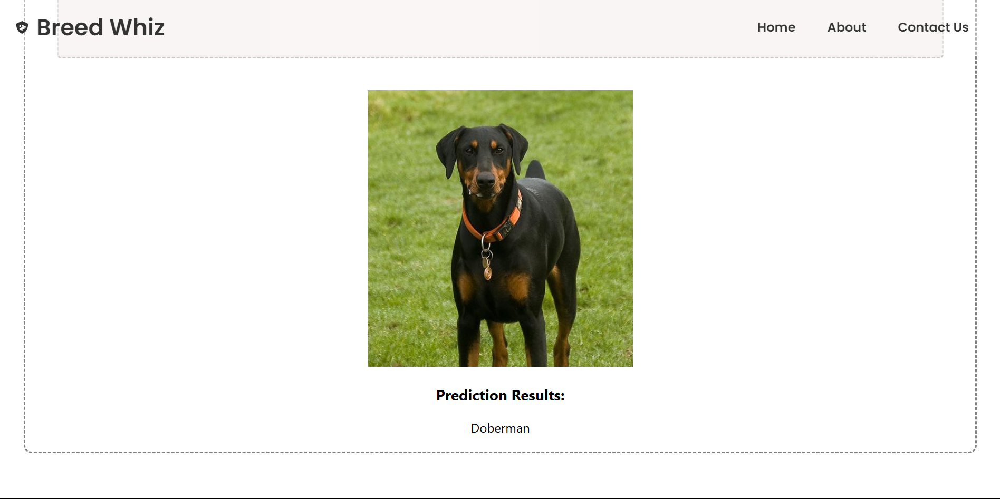

# 🐶 Dog Breed Classifier Frontend
This is the frontend for the Dog Breed Classifier, a web application that allows users to upload an image of a dog and get its breed prediction using an AI-powered model. The frontend is built using React.js, providing a user-friendly and responsive interface.

# Small peek into our application 


# Features
✅ Upload an image of a dog
✅ Get real-time breed classification results
✅ Clean and intuitive UI
✅ Mobile-friendly and responsive design

# Tech Stack
React.js - Frontend framework
CSS - Styling
Axios - API requests
React Hooks - State management
File Upload Handling


# 📦 Setup & Installation

1️⃣ Clone the repository:
```
git clone https://github.com/yourusername/Dog_Breed_Classifier_Frontend.git
cd Dog_Breed_Classifier_Frontend
```
2️⃣ Install dependencies:
```
npm install
```

3️⃣ Start the development server:
```
npm start
```

4️⃣ Open in browser:
```
http://localhost:3000
```
